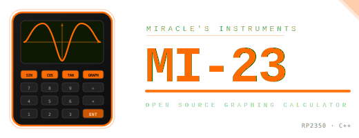

# Miracle's Instruments - MI-23
<div align="center">
  
  <p>MI-23 is a DIY graphing calculator powered by the Raspberry Pi RP2350, built as an open-source alternative to the TI-84 Plus CE at a fraction of the cost. Inspired by NumWorks, the MI-23 targets students who need an affordable, exam-approved graphing calculator without sacrificing performance.</p>
</div>

## Features

- Arithmetic expression evaluation with correct operator precedence
- Dual-platform codebase — runs as a desktop simulator (SDL2) and on real hardware (RP2350)
- Modular HAL (Hardware Abstraction Layer) architecture for easy platform extension
- Unit tested expression parser using Google Test framework
- Support for decimal numbers and parentheses in expressions
- Real-time expression rendering and error handling
- Static and dynamic SDL2 linking options for release and debug builds
## Hardware

| Part | Details |
|------|---------|
| MCU | Waveshare RP2350-PiZero (RP2350, 16MB flash) |
| Display | 2.0" ST7789 TFT 320×240 via SPI |
| Keypad | 4×4 matrix keypad (40+ key layout planned) |
| Battery | 3.7V LiPo |

---

## Running the Simulator

The simulator lets you run MI-23 on your computer without any hardware. It uses SDL2 to emulate the display and accepts keyboard and mouse input.

### Prerequisites

#### Linux (Debian/Ubuntu/Fedora)
```bash
# Debian / Ubuntu
sudo apt install cmake g++ libsdl2-dev libgtest-dev

# Fedora
sudo dnf install cmake gcc-c++ SDL2-devel gtest-devel
```

#### macOS
```bash
brew install cmake sdl2 googletest
```

#### Windows
The recommended approach on Windows is to use [MSYS2](https://www.msys2.org). After installing, open the MSYS2 MinGW 64-bit shell and run:
```bash
pacman -S mingw-w64-x86_64-cmake mingw-w64-x86_64-gcc mingw-w64-x86_64-SDL2 mingw-w64-x86_64-gtest
```

---

### Build and Run

```bash
git clone https://github.com/MiracleAig/MI-23
cd MI-23

./build.sh --clean --platform=host

./build-host/firmware/platform/host/sdl_simulator/mi23
```

## Building for Hardware

### Prerequisites

You'll need the [Raspberry Pi Pico SDK](https://github.com/raspberrypi/pico-sdk) cloned somewhere on your machine.

```bash
git clone https://github.com/raspberrypi/pico-sdk ~/pico-sdk
cd ~/pico-sdk && git submodule update --init
```

### Build

```bash
./build.sh --clean --platform=rp2350
```

This produces `/build-rp2350/firmware/platform/rp2350/mi23.uf2`.

### Flash

1. Hold the **BOOT** button on the Waveshare RP2350-PiZero while plugging in USB
2. It mounts as a USB drive on your computer
3. Drag and drop `mi23.uf2` onto it
4. The board resets automatically and starts running

---

## Project Structure

```
firmware/
├── app/                     # High-level applications
│   ├── calculator/          # Standard calculator mode
│   └── graphing/            # Graphing engine (in progress)
├── drivers/                 # Low-level hardware drivers
│   └── st7789/              # ST7789 display driver
├── graphics/                # Rendering utilities and primitives
├── hal/                     # Hardware Abstraction Layer interfaces
├── math/                    # Expression parser and evaluation engine
└── platform/                # Platform-specific implementations
├── host/
│   └── sdl_simulator/   # Desktop simulator backend
└── rp2350/
└── config/          # RP2350 build/config definitions
```
---

## Running Tests

From base project directory:
```bash
./mi23 --test
```

---

## License

MIT — see [LICENSE](LICENSE) for details.

*Student passion project — contributions welcome.*
